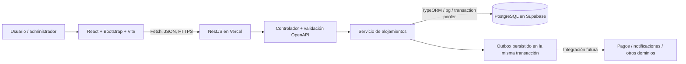
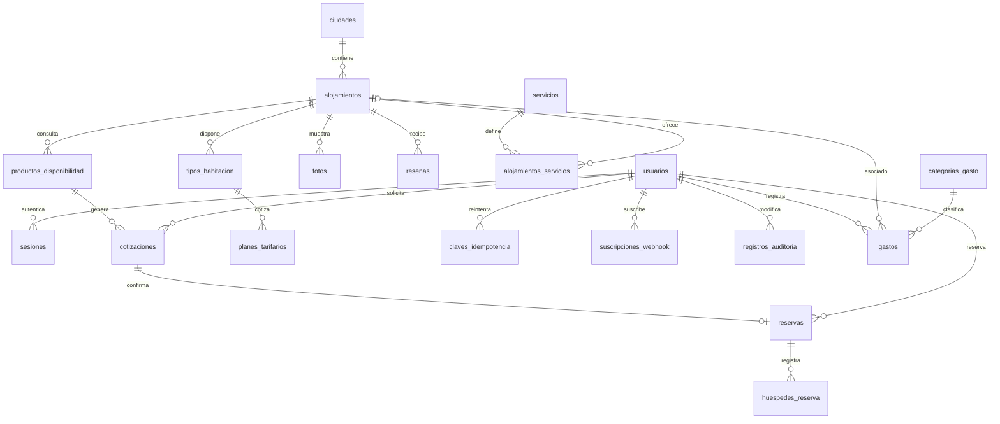

# Arquitectura y modelo de datos

Kawsay Estancias implementa el dominio de **alojamientos** del repositorio `semestre5grupal-ops/Plantilla-Integracion-Sistemas`. Conserva NestJS, TypeScript y TypeORM. El núcleo REST utiliza el contrato propio `contracts/kawsay-estancias-openapi.yaml`, publicado y utilizado para validar solicitudes con AJV; el contrato de la plantilla se conserva como referencia. Los otros dominios permanecen como plantilla y no se compilan ni se exponen.

React consume APIs del mismo origen mediante Fetch. React Router protege `/reservas` y `/admin`; las APIs vuelven a verificar permisos. CORS tiene una lista de orígenes exactos y credenciales habilitadas. Las contraseñas se derivan con scrypt y sal aleatoria; los JWT firmados con HS256 se almacenan hasheados para revocación, con vencimiento de una hora. Se verifican firma, algoritmo, emisor, audiencia e identidad; el rol actual se obtiene de la base. Las cookies son HttpOnly, SameSite Strict y Secure en Vercel. Cada operación administrativa verifica el rol en el servidor. Las reservas se consultan por propietario; conocer un UUID no concede acceso.

## Modelo relacional: 28 tablas

| Tabla | Propósito | Relaciones principales |
|---|---|---|
| usuarios | Clientes y administradores; credenciales derivadas | Padre de sesiones, reservas y auditoría |
| sesiones | Sesiones con token hasheado y vencimiento | usuario_id → usuarios |
| ciudades | Destinos y código de país | Padre de alojamientos |
| cadenas_hoteleras | Catálogo inicial de cadenas | Preparado para futura asociación de marcas |
| alojamientos | Nombre, destino, descripción, dirección, publicación | ciudad_id → ciudades |
| tipos_habitacion | Capacidad de adultos/niños e inventario de habitaciones | alojamiento_id → alojamientos |
| planes_tarifarios | Tarifa vigente, moneda y política de cancelación | tipo_habitacion_id → tipos_habitacion |
| servicios | Servicios disponibles | Catálogo de servicios |
| alojamientos_servicios | Relación entre propiedades y servicios | alojamiento_id y servicio_id; par único |
| fotos | Fotografías de propiedades | alojamiento_id → alojamientos |
| resenas | Reseñas, autor, comentario y puntuación | alojamiento_id → alojamientos |
| productos_disponibilidad | Oferta disponible, fechas, huéspedes, precio, vencimiento | alojamiento_id → alojamientos |
| cotizaciones | Cotización asociada al usuario | producto_id → productos_disponibilidad; propietario_id → usuarios |
| reservas | Reserva, estado, localizador, fechas, total y referencia de pago simulado | alojamiento_id, propietario_id, cotizacion_id; cotizacion_id único |
| huespedes_reserva | Titular de la reserva; preparado para lista nominativa de huéspedes | reserva_id → reservas |
| claves_idempotencia | Operación, huella del cuerpo y respuesta previa | propietario_id → usuarios |
| eventos_pendientes | Eventos durables preparados para entrega futura | recurso_id identifica el agregado |
| suscripciones_webhook | Suscripciones, URL HTTPS, eventos y secreto | propietario_id → usuarios |
| registros_auditoria | Quién creó, editó o eliminó una propiedad | actor_id → usuarios |
| categorias_gasto | Clasificación de gastos operativos | Padre de gastos |
| gastos | Concepto, proveedor, importe, fecha, estado y notas | categoria_id → categorias_gasto; alojamiento_id → alojamientos opcional; actor_id → usuarios |
| bloqueo_transacciones | Fila común para serializar cambios de inventario | id=1 |
| perfiles_usuario | Contacto y documento privados | usuario_id → usuarios; perfil único |
| calendario_tarifas | Precio, cupo y cierre por fecha | alojamiento y administrador |
| facturas | Documento simulado y versionado | reserva y propietario |
| detalles_factura | Líneas del documento y subtotales | factura_id → facturas |
| resenas_estancia | Opinión de estancia completada y respuesta | reserva, usuario, alojamiento y administrador |
| imagenes_alojamiento | Cuatro fotos ordenadas con créditos | alojamiento_id → alojamientos; posición y URL únicas |

La migración inicial es `supabase/migrations/001_booking.sql`. Usa claves foráneas, restricciones de capacidad, tarifas positivas, estados válidos, índices de disponibilidad e índices de propietario. Los importes se guardan como NUMERIC y se redondean a centavos en la lógica de precios. Las fechas de estancia son cadenas ISO `YYYY-MM-DD`; los instantes son ISO 8601 UTC. JSON se reserva para atributos anidados del contrato (huéspedes, cuerpo de evento y respuesta idempotente); los agregados principales viven en tablas separadas.

## Disponibilidad y consistencia

Cada reserva confirmada bloquea el alojamiento completo para todos los usuarios durante las noches del intervalo `[fecha_entrada, fecha_salida)`, aunque exista inventario adicional de habitaciones. Se rechazan coincidencias totales y parciales en búsqueda, disponibilidad, cotización, confirmación y modificación. Al modificar se excluye únicamente la propia reserva. Las reservas canceladas liberan las noches y la fecha de salida permite comenzar otra estancia. Se comprueba también capacidad de adultos y niños por número de habitaciones solicitado. El precio se calcula en servidor: tarifa × noches × habitaciones. El prototipo trabaja en USD y no agrega impuestos ficticios ni efectúa conversiones.

Consultar disponibilidad genera un producto válido 15 minutos; previsualizar genera una cotización válida 10 minutos. Al confirmar, se vuelve a verificar cupo, precio, propietario y vencimiento. La reserva, respuesta idempotente y evento outbox se guardan en una única transacción. En PostgreSQL se bloquea `bloqueo_transacciones` con `SELECT FOR UPDATE`, lo que impide sobreventa entre instancias de Vercel. El bloqueo global simplifica la defensa y sacrifica concurrencia; en una evolución se reemplazaría por bloqueos por propiedad/fecha.

En desarrollo se usa SQL.js con archivo persistente `data/booking.sqlite`, para ejecutar sin Docker. Es un adaptador local, **no la base de datos de producción**. En Vercel DATABASE_URL es obligatoria y se prohíbe arrancar con almacenamiento local. La migración de producción se aplica explícitamente; `synchronize` está desactivado en PostgreSQL. La migración 006 instala un trigger que rechaza reservas confirmadas solapadas con código PostgreSQL `23P01`, traducido a HTTP 409. El servidor instala esta protección si falta al iniciar, bajo un bloqueo de migración. La protección conserva los registros existentes y evita nuevos solapamientos incluso desde versiones anteriores del servidor. El endpoint de salud informa si el trigger está activo.

## Límites del prototipo

Una habitación estándar y un plan de tarifa por alojamiento; las tablas admiten ampliación. La administración gestiona cuatro fotos ordenadas, WiFi y piscina; los catálogos y reseñas se cargan como datos de demostración. No se integra un GDS real, proveedor de pagos ni IdP OAuth2. Las reseñas semilla se etiquetan como demostración. Las cadenas son un catálogo preliminar, sin relación activa con hoteles. Los eventos se persisten y se consultan, pero no se entregan automáticamente. El límite de intentos de autenticación es por instancia; un servicio distribuido debe sustituirlo si crece el uso.

La migración `002_nombres_espanol.sql` renombra tablas y columnas sin borrar registros. TypeORM conserva los identificadores internos y los campos exigidos por el contrato de APIs mediante un mapeo explícito a los nombres físicos en español. Las claves foráneas, índices y permisos se conservan durante el renombrado.

El frontend usa `BookingProvider` y hooks para sesión, búsqueda, diálogos y actualización de datos. `useResource` gestiona cargas y errores. Administración y reservas se cargan con imports diferidos; Vite genera bundles minificados con hash. Bootstrap proporciona controles, tablas, alertas y utilidades; los estilos propios mantienen la identidad visual.

Las cinco tablas de la migración 004 son perfiles_usuario, calendario_tarifas, facturas, detalles_factura y resenas_estancia. La migración 005 añade imagenes_alojamiento y su relación con alojamientos. El esquema tiene 32 claves foráneas. Sus relaciones, reglas y endpoints se describen en [estancias](estancias.md) y [galerías](galerias.md).
